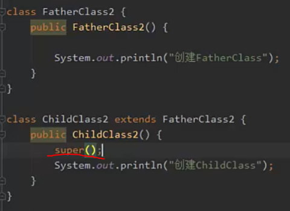
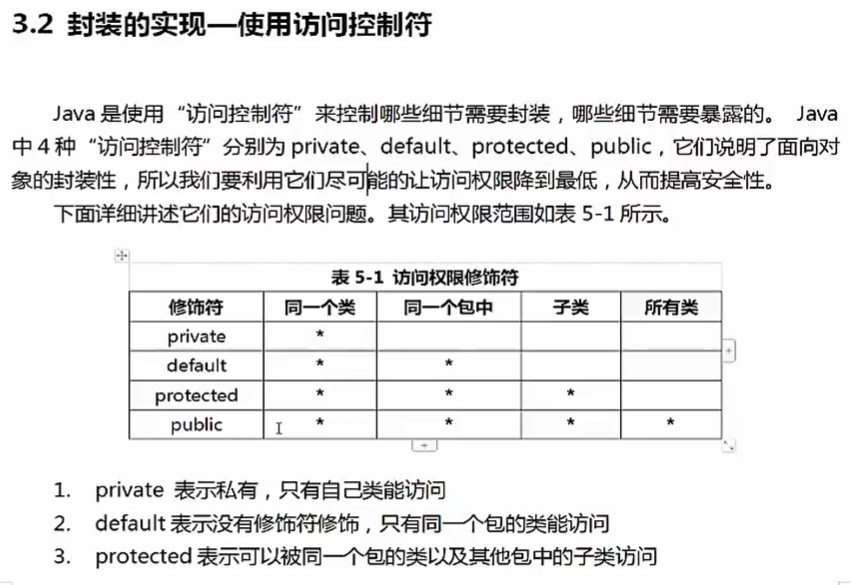

刷尚学堂视频

1. Java中注释 @author @param 。。。
2. 标志符可以_$开头
3. java 采用**unicode**字符集 所以中英文都一样，被认为是普通字符
4. 数字不能作为标志符开头
5. 命名规则 驼峰规则 int ageSalaryStudent...
6. 表示类名的标志符 每个单词首字母大写
7. 表示函数的韩变量的标志符每个名字 第一个单词小写 其余的首字母大写
8. 变量 可操作的存储空间，空间的位置是确定的，但其中的值不确定。空间的大小和内容不确定。
9. java是强类型语言
10. double 8字节 byte, 一个byte 8 bit
11. 基本类型 引用类型

变量分类作用域

1. 局部变量  在哪儿定义的就属于哪里
2. 成员变量  实例变量 类内 方法外
3. 静态变量 类内 static修饰
        
        使用Static定义，充数鱼类，生命周期伴随类始终。从类加载到卸载。如果不自动行初始化，与成员变量相同，会自动初始化成该类型的默认初始值、

常量 constant 
1. 一个固定的值,不变的量
2. 专用
3. 通常用 final 来修饰

基本数据类型

1. 基本类型
   1. 数值型
      1. 整数类型   byte short int long
      2. 浮点类型   doublt float
   2. 字符型
   3. 布尔型
2. 引用类型 4字节(byte)
   1. 类
   2. 接口
   3. 数组

1 byte = 8 bit

整型
byte    1 byte      -128 - 127
short   2 byte      -2^15 - 2^15-1
int     4 byte      -2^31 - 2^31-1 约20亿
long    8 byte      -2^63 - 2^63-1

整型常数默认为int类型  
        long f = 5555555;
        long ff = 555555555555L;

浮点型 有误差的

-------占用空间

float------4byte   单精度类型 精确到7位有效数字

double---8byte

BigDecimal类帮助计算

float f = 1.65F

注意浮点数之间的比较 有概率出错

字符型

char a = 'a'; 也可以用unicode

char b= '\u0061';

Java 字符串 String不是一个基础类型 而是一个类

Java 中的boolean类型  true false 小写。 Python 中的bool True和False
boolean单独使用四个byte
在数组中使用 一个byte

自增 子
int b = 3
int a = b++ 先赋值再自增
int a = ++b 先自增再赋值

逻辑与 & 两个都为true 结果才位true 否则是false

逻辑或 | 两个操作有一个操作数是true 结果就是true

短路与 && 只要有一个为false 则直接返回false

短路或 || 只要有一个为true 则直接返回true

逻辑异或 ^ 

非 !

P46  
https://www.bilibili.com/video/BV1oy4y1H7R6?p=45

位运算符，位运算指的是进行二进制运算

~ 按位取反 
& 按位与 
| 按位或 
^ 按位异或 
<< 左移运算符 
\>\> 右移运算符 
左移等同于*2 
右移等同于/2

字符串连接符 

char类型使用+链接会返回两个char的ascii的值之和
使用字符串连接符的条件是两个字符串

条件运算符 三目运算符  
conditions?valueA:valueB
条件运算符可以用于赋值

通常可以用于代替if else

运算符优先级  不需要全部掌握，了解大概就ok,复杂表达式用()组织优先级问题
                  

ps: char (0-65535)

浮点数不精确，虚线表示转换的时候会有精度损失

类型转换 casting

超出目标类型的表数范围 就会截断成一个完全不同的值

操作大数的时候 注意是否有溢出
直接相乘会出报错

 解决方法：

或者 long total2 = 1L*money*years

定义long类型 在数字末尾加上L，不要使用小写  “l”，会导致l看成 “1”

键盘输入Scan

import java.util.Scanner; 
Scanner scanner = scanner.nextLine();

scanner创建了一种阻塞

overload 方法重载 overload 
1. 相同的函数名，形参的类型个数和顺序不同
2. 只有返回值不同不构成函数的重载
3. 只有形参的名称不同不构成函数重载

**Java OOP**

思考表格和instance

* OOD面向对象设计
* OOA面向对象分析
* OOP面向对象编程
* 面向过程是一种执行者思维 解决简单的问题可以通过面向过程
* 面向对象是一种设计者思维 解决复杂需要协作的问题可以使用面向对象
* 面向对象离不开面向过程
  * 宏观上 通过面向对象进行整体设计
  * 微观上 执行和处理数据仍然是面向过程
  

属性 成员变量 

构造函数四个要点
1. 通过new使用
2. constructor 有返回值 但是不能定义返回值
3. 如果没有定义返回值，编译器回自己定义一个无参构造函数；如果已定义则不会自动添加
4. constructor的函数名必须和类名一致

OOP 内存分析
1. 虚拟机内存模型

2. 执行过程中的内存分析
3. 参数传值机制

垃圾回收
1. 原理和算法
2. 分代垃圾回收机制
3. JVM调优和FUllGC
4. 内存泄漏
   
static this
1. this
2. static
3. 静态初始化块
   
包机制
1. package
2. import
3. static import

 

1. 线程计数器 记录当前线程正在执行的Java方法的jvm指令地址，即字节码行号。如果正在执行native 方法 则计数器为空
2. java虚拟机栈 java virtual machine stack，线程私有区，每个线程创建的时候都会创建一个虚拟机栈，生命周期和线程一直。线程退出，线程虚拟机栈也被回收。虚拟机内部会保持一个个的栈帧，每次方法调用都会进行压栈。JVM对于栈帧的操作只有进栈和出栈两种。方法调用结束时会进行出栈操作。该区域村住着局部变量表，编译时期可知的各种基本类型数据，对象引用方法出口信息等。
3. 本地方法栈与虚拟机栈类似（native method stack），本地方法栈是在调用本地方法时使用的栈 每一个线程都有一个本地方法栈。
4. 堆，几乎是所有的Java对象实例都是费配到堆上。堆被所有线程共享。在对上的区域会被垃圾回收机制做进一步划分
5. 方法区， method area, 所有线程共享 存储不变的数据. 方法区是一种java虚拟机的规范。JDK8之后永久代不存在，编译后的代码移动到了元空间 metaspace中。 3
6. 常量池
   1. 字面量 文本字符 final常量值
   2. 符号引用
7. 直接内存

虚拟机栈
1. 栈描述的是方法执行的内存模型。每个方法被调用都会创建一个栈帧。存储局部变量，操作数，方法入口。
2. JVM为每个线程创建一个栈，用于存放该线程执行方法的信息（实际参数，局部变量）
3. 栈属于线程私有，不能实现线程间的共享. (有疑问)
4. 栈 filo first in last out
5. 栈有系统自动分配。是一个连续的空间
   

堆得特点
1. 用于存储创建好的对象和数组，数组也是对象
2. JVM只有一个堆，所有线程共享
3. 堆是一个不连续内存空间，费沛灵活速度慢

方法区
1. 方法区是Java的虚拟机规范 有不同的实现方法
2. jvm只有一个方法区 被所有线程共享
3. 方法区实际上也是堆，用于存储类 常量相关信息

Garbage Collection
1. Java内存管理很大程度指的是对中对象的管理，其中包括对象空间的分配和释放
   1. 对象空间的分配 使用new关键字创建对象
   2. 对象空间的释放 赋值null即可，垃圾回收期将负责回收所有不可达的对象的内存空间
2. 垃圾回收过程
   任何一种垃圾回收算法都要做到两件基本事情
   1. 发现无用对象
   2. 回收无用对象的内存空间
    
   垃圾回收机制保证可以将无用对象进行回收 无用对象指的是没有任何变量引用该对象，java垃圾回收期通过相关算法发现无用对象，进行清除和整理
3.  垃圾回收相关算法
    1. 引用计数法 记录引用的数量 引用值为0，则无人使用，则进行回收。缺点是循环引用的无用对象无法识别
    
    2. 引用可达法
      利用图算法实现。从一个GCroot开始，寻找对应的引用节点，找到该节点后继续寻找这个节点的引用节点，当所有引用节点寻找完毕后，剩余的节点将被视为无用节点。

分代垃圾回收机制
1. 年轻代 Eden区 存储了从未通过垃圾回收的新对象
2. 年老代 Survivor区 存放垃圾回收之后仍然有用的对象 循环存放小于15次垃圾回收次数 
3. 永久代 Tenured区 年老代区域存放超过15次垃圾回收的对象

Minor GC: 用于清理年轻代区域，Eden区存满了就会触发一次Minor GC，清理无用对象，将所有有用对象赋值到Survivor1 Survivor2区中

Major GC: 用于清理年老代区域

Full GC： 用于清理年轻代，年老代区域。成本较高，对于系统性能产生影响

垃圾回收两个步骤 1. 发现垃圾 2. 回收垃圾

垃圾回收两种方法 1.引用计数法 2. 根搜索法

堆内存划分 年轻代，老年代 永久代。 立即回收期划分成 Minon GC, Major GC; Full GC. 

MinorGC Eden

MajogGC Survivor

FullGC Eden,Survivor，Tenured

System.gc() 建议调用 FullGC

this
1. 在容易产生二义性的地方，用this指代当前对象；普通方法中，this指向调用用该方法的对象，构造方法中this总是指向当前初始化的对象
2. 使用this关键字调用重载的构造方法，避免相同的初始化代码，但只能在构造方法中使用，且必须位于构造方法的第一句
   
3. this不能用于static方法中

Static 再类中 用static生命的变量成员为静态变量成员。也成为了类变量。类变量生命周期和类相同。在整个应用程序执行期间都有效。有如下特点
1. 为该类的公共变量，属于类，被该类的所有实例共享，在类被载入时显式初始化
2. 对于该类的所有对象来说，static成员变量是有一份，被所有对象共享
3. 一般用 类名.变量名/方法名 调用 也可以通过对象引用或类名访问静态成员
4. 在static方法中不可直接访问非static的成员
   
静态初始化块
构造方法用于对象的初始化，静态初始化块，用于类的初始化操作，在静态初始化块中不能直接访问非static成员

静态初始化块的执行顺序
1. 上诉到Object类 限制性object的静态初始化块，在乡下执行子类的静态初始化块，直到类的静态初始化块为止
2. 构造方法执行顺序和上面的顺序一样

Java包机制 package 
管理类 相似的放一起 包名有要求
1. 通常是类的第一句飞猪实行语句
2. 包名 域名倒着写即可 再加上模块名 便于内部管理类

Java 常用包
*  java.lang String, Math, Interger, System, Thread ..
*  java.awt GUI开发
*  java.net 网络相关操作
*  java.io 输入输出流
*  java.util 一些实用工具类，时间 日历

import
导入类
遇到重名的类 写全名
例如：
      
      java.util.Date
      java.sql.Date

静态导入 用于导入指定类的静态属性.

继承 extends
代码复用 类的拓展

继承的几个要点
1. 父类也成超类 基类 派生类
2. java中只有单继承。
3. java中接口可以多继承
4. 自雷继承父类可以得到父类的所有属性和方法（除了父类的构造方法） 但是不见得可以直接访问，比如说父类的私有属性和方法
5. 如果定义一个类式 没有调用extends 则它的父类是 java.lang.Object

判断instance 是否属于某个class

方法重写 override
子类通过重写父类的方法，可以用自身的行为替换父类的行为。方法重写是实现多态的必要条件。方法重写符合以下三个要点：
1. 方法名 形参列表相同
2. 返回值类型和声明异常类型 子类小于等于父类
3. 访问权限 子类大于等于父类

关键字 final（不可更改 不可拓展）
1. 修饰变量，被修饰的变量不可变
2. 修饰方法 方法不可重写但可以重载
3. 修饰类，类不可继承
4. 父类中的final方法可以被继承 但是不能被重写

继承和组合 组合比继承更灵活。组合就是在一个类中写另一个类的对象。如下图

is-a关系(student is a person) 用继承

has-a关系(student has a person) 用组合

IDEA 
1. alt+7 查看类结构
2. alt+左键 源码
3. 光标放在类名上 右键diagram查看源码
4. alt+insert自动生成 constructor, equals(), toString()

Object类 所有Java类的父类

toString() 原始 class+address

equals() 和 ==
* == 判断两个对象是否同一个对象
* equals 判断两个对象逻辑上的值是否一样
* 重写equals的例子
  

关键字 super 
1. 可以看做直接父类对象的引用。可以通过super访问父类中被子类覆盖的方法或属性。
2. 使用super调用普通方法，语句没有位置限制，可以在子类中随便调用
3. 若构造方法的第一行代码没有显式的调用super或者this，java默认都会调用super，含义是调用父类的无参构造方法，这里的super可以省略

继承树的追溯

1. 属性/方法查找顺序（比如说查找属性h）
   * 查找当前类中有没有属性h
   * 依次上溯每个父类查看父类中是否有h直到object
   * 如果没有找到，编译错误
   * 上面的步骤 只要找到了h变量，整个过程终止
2. 构造方法的调用顺序。
   构造方法的第一句总是 super()来调用父类对应的构造方法。所以流程是线向上追溯到Object，然后依次向下执行类的初始化块和构造方法，直到当前子类为止  

   静态初始化块的调用顺序与构造方法调用顺序一样

封装 encapsulation
**高内聚 低耦合**

封装就是把对象的属性和操作结合为一个独立的整体，尽可能隐藏对象内部的实现细节

封装的具体优点
1. 提高代码安全性
2. 提高代码复用性
3. 高内聚： 丰庄西街，便于修改内部代码，提高可维护性
4. 低耦合：简化外部调用，便于调用者使用，便于拓展和协作

封装的简单规则
1. 一般使用private访问权限
2. 属性私有后 提供相应的get set方法来访问属性，这些方法通常用public修饰。已提供对于属性的赋值和读取操作
3. 方法：一些只用于本类的辅助性方法可以用private修饰，希望其他类调用的方法用public修饰
   

**多态 polymorphism**

多态的意思 多种形态。同一个方法的调用，由于对象不同，可能有不同的行为。

多态的要点：
1. 多态是方法的多态 不是属性的多态， 多态与属性无关
2. 多态的三个必要条件 继承 方法的重写 父类引用指向子类的对象
3. 父类引用指向子类对象后，用该父类引用调用子类重写的方法，此时多态就出现了
4. 程序更加灵活，如果没有多态，多次的重载，重写会复杂程序设计。

Polymorphism Example. 在这个例子中，dog cat继承了animal。在test class中输出动物叫。aminamcry的参数为父类animal。当参数值为子类，会自动转型为对应的子类，然后调用对应的函数。但是如果没有使用多态，则达到同样的结果需要重载animamcry，更改入口参数的类型。如果后期要增加不同的动物叫，则需要添加更多的动物叫函数重载。不利于程序的维护和拓展开发。

向上转型后的父类引用只能调用她的变异类型方法，不能调用它的运行时类型的方法。这是就需要类型转换。称之为向下转型。

向下转型 必须将引用变量转换成真是的子类类型（运行时类型）否则会出现类型转换异常 ClassCastException。

为了避免这种异常可以通过instanceof运算符进行检查

**多态总结** 

1. 同一个方法调用的时候传入不同的对象 可能会调用不同对象的方法
2. 这些对象对应的子类重写了父类的方法
3. 三个必要条件 继承 重写 父类引用指向子类对象
4. 类型转换，编译通过只是进行语法检查。编译成功不代表程序没有bug。

**抽象类 和 接口**

**抽象方法**

用abstract修饰的方法，没有方法体只有声明，定义的一种规范，就是告诉紫类比需要给抽象方法提供具体的实现。

**抽象类** 

包含抽象方法的类就是抽象类，通过abstract方法定义规范，然后要求子类必须定义具体实现，通过抽象类，我们就可以做到严格限制子类的设计，使子类之间更加通用。

抽象类的使用要点：
1. 有抽象方法的类只能定义为抽象类
2. 抽象类不能实例化 即 不能用new来实例化抽象类
3. 抽象类可以包含属性 方法 构造方法。但是构造方法不能用来new实例，直接嫩雇佣来呗子类调用
4. 抽象类只能用来被继承
5. 抽象方法**必须**被子类实现

**接口 interface**
* 接口就是规范，定义的是一组规则。体现了现实世界中“如果你是。。，则必须能。。”的思想。
* 接口的本质是一种契约，制定好了之后大家都要遵守
* 设计和实现彻底分开
* 面向对象的精髓。是对对象的抽象。

**接口的作用**
1. 比"抽象类"还要"抽象"的"抽象类",可以更加规范的对子类进行约束。全面的实现了规范和具体实现的分离
2. 抽象类提供了某些具体实现，借口不提供任何实现，接口中所有方法都是抽象方法，接口是完全面向规范的，规定了一批类具有的公共方法规范。
3. 从接口的实现者角度看，接口定义了可以向外部提供的服务
4. 从接口的调用者角度看，接口定义了实现者能提供哪些服务
5. 接口是两个模块之间的通信标准，通信规范。如果把你要设计的模块之间的接口定义好，就相当于完成了系统的设计大纲，剩下来的就是添砖加瓦的具体实现，
6. 接口和实现类不是父子关系而是实现规则的关系

**区别**
* 普通类 具体实现
* 抽象类 具体实现 规范（抽象方法） 抽象类中可以有非抽象方法
* 接口：规范

**接口形式**

[访问修饰符] interface 接口名 [extends 父接口1，父接口2,...]{
   常量定义；
   方法定义；
}

**接口定义说明：**
* 访问修饰符 只能是public或默认
* 接口名，和类名采用同样的命名机制
* extends 可以多继承
* 常量，接口中的属性只能是常量，总是public static final,不写也是这个
* 方法，接口中的方法只能是 public abstract，省略的话也是public abstract

**要点**
* 子类通过implements实现接口中的规范
* 接口不能创建实例，但是可以用于声明引用变量类型
* 一个类实现了接口，必须实现接口中的所有方法，并且这些方法只能是public的
* JDK1.8之前，接口中只能包含静态常量，抽象方法，不能带有普通属性，私有方法，普通方法
* JDK1.8(包括8)之后，接口中包含普通的静态方法，默认方法
  
类可以实现多个接口

接口也已作为引用类型

Java8之后，允许接口里定义默认方法和类方法

**默认方法**
1. 默认方法 java8及以上旧版本允许接口添加一个非抽象的方法实现，是需要使用default关键字。这个特征称作默认方法，也称作拓展方法
2. 默认方法和抽象方法的区别是抽象方法必须要被实现，默认方法不是。作为替代方式，接口可以提供默认方法的实现，所有这个接口的实现类都会通过继承得到这个方法
3. 接口中使用默认方法必须加上default关键字

**静态方法**

1. Java8之后 接口中可以直接定义静态方法的实现。静态方法从属于借口。
2. 接口 抽象类也是类，接口是一种非常特殊的类以至于我们需要一个新词儿来描述 interface
3. 调用的时候  接口名.方法名()
4. 静态方法不能重写

**接口多继承**

接口完全支持多继承，和类的继承类似，子接口拓展某个父接口，将会获得父接口中定义的一切。

**字符串**

放在常量池中

下图中使用两个方法构建了string 由于==比较的是两个对象的地址，一个是在常量池中 一个位于堆中，地址不同 所以==结果是不想等

<!--  -->

 

 
 
 

使用 equals() 对比两个字符串是否相等

**String类和常量池**

**以下 看看就好**  
java内存分析中 经常会提到以下几个常量池

1. 全局字符串常量池 (String Pool) 
     全局字符串常量池中存放的内容实在类加载完成后存到String Pool中的，在每个VM中只有一份，存放的是字符串敞亮的引用 (在堆中生成字符串对象实例) 
2. class 文件常量池 (class Constant Pool)
     class常量池是在编译的时候每个class都有的，在编译阶段，存放的是常量(文本字符串，final常量等)和符号引用
3. 运行时常量池 (Runtime Constant Pool)
     运行时常量池是在加载完成之后，将每个class常量池中的符号引用值转存到运行时常量池中，也就是说每个class都有一个运行时常量池，类在解析之后，将符号引用替换为直接饮用，与全局常量池中的引用保持一致

**常用String函数**

1. str1.equals(str2) str1和str2 是否相同
2. length() 字符串长度
3. str1.charAt(index) str1 在下标为index的地方的字符
4. equalsIgnoreCase(String other) 忽略大小写是否相等
5. str1.indexOf(str2) 从左到右找大的第一个在str1中的str2，如果没找到返回-1
6. str1.lastindexof(str2) 琢磨为找第一个子字符串的位置
7. replace(char oldChar, char newChar)  可以换一个 也可以换一个字符串
8. str1.starwith(str2) 是否以某个字符串为开头
9. str1.endwith(str2) 是否以某个字符串为结尾
10. str.substring(index1) 返回index1到末尾
11. str.substring(index1,index2) 返回index1到index2的值，包括index1不包括index2
12. str.toLowerCase() 小写
13. str.toLowerCase() 大写
14. str.trim() 删除该串中头部和尾部的空白字符

String  不可变字符序列，所有的替换截取字符穿，去空格，转换大小写都是生成了新的字符串

**内部类**

内部类是一类特殊的类，指的是定义在一个类的内部的类。实际开发中，为了方便的使用外部类的相关属性和方法，这个时候我们通常会定义一个内部类

内部类可以直接使用外部类的成员，私有也行

**内部类概念**

一般情况，我们把类定义成独立的单元，有些情况下，我们把一个类放在一个类的内部定义，成为内部类，innerclasses

内部类可以使用public default protected private 和static修饰。而外部类只能用default和public修饰

注意 内部类是一个编译时概念。一旦编译成功，就会成为两个完全不同的类，对于一个名为Outer的外部类和其内部定义的名为Inner的内部类。编译完成后会出现Outer.class和Outer$Inner.class两个类的字节码文件。所以内部类是相对独立的一种存在。其成员变量方法名可以和外部类的相同。

**内部类的作用**
1. 内部类提供了更好的封装 只能让外部类直接访问，不允许同一个包中的其他类直接访问
2. 内部类可以直接访问外部类的私有属性，内部类被当做其外部类的成员。但外部类不能访问内部类的内部属性。

**内部类的分类**

**成员内部类 - 非静态内部类**（外部类里使用非静态内类和平时使用其他类没有什么不同）
1. 非静态内部类对象必须及存在一个外部类的对象里。因此，如果有一个非静态内部类对象，那么一定存在对应的外部类对象。非静态内部类对象单独属于外部类的某个对象
2. 非静态内部类可以直接访问外部类成员但是外部类不能直接访问非静态内部类成员。
3. 非静态内部类不能有静态方法，静态属性和静态初始化块
4. 成员变量访问要点
   1. 内部类里方法的局部变量：变量名
   2. 内部类属性： this.变量名
   3. 外部类属性：外部类名.this.变量名
   

**静态内部类** 就是在class前加个 static
1. 定义方式

         static class ClassName{
            //class content
         }
2. 使用要点
   1. 静态内部类可以访问外部类的静态成员，不能访问外部类的普通成员
   2. 静态内部类看做外部类的一个静态成员

**匿名内部类**

适合那种只需要使用一次的类。比如说键盘监听操作等。在安卓开发，awt，swing开发中常见

语法：

         new 父类构造器(实参类表) \实现接口(){
            // 匿名内部类类体
         }

Example:

         package com.AnonymousClass;
         public class TestAnonymousClass {

            public void test(A a) {
               a.run();
            }

            public static void main(String[] args) {
               TestAnonymousClass tm = new TestAnonymousClass();
         //        tm.test(new AA());
               tm.test(new A() {
                     @Override
                     public void run() {
                        System.out.println("TestAnonymousClass.run0");
                     }
               });
               tm.test(new A() {
                     @Override
                     public void run() {
                        System.out.println("TestAnonymousClass.run1");
                     }
               });

            }
         }

         class AA implements A {
            @Override
            public void run() {
               System.out.println("AA.run()");
            }
         }

         interface A {
            void run();
         }

         OUTPUT:  TestAnonymousClass.run0
                  TestAnonymousClass.run1

没用一次调一次 每一次都是新的

**局部内部类**

定义在方法内部的，作用于只限于本方法，成为局部内部类

局部内部类的使用主要是用来解决比较复杂的问题。想创建一个类来辅助我们的解决方案，到那个时候又不希望这个类是公共可用的，所以就产生了局部内部类。局部内部类和成员类一样被编译，只是她的作用域发生了改变，他只能在该方法中被使用，除了该方法就会失效。

实际开发中应用很少
 

**Array**
1. 数组定义 概念
2. 常见的操作
3. 多维数组
4. 常见算法

数组定义 相同类型数据的有序集合。数组描述的是想同类型的若干数据按照一定的先后次序排列组合而成。其中一个数据成为一个元素。每一个元素都可以通过下标访问。

四个基本特点
1. 长度确定，一旦创建 长度无法改变
2. 元素类型必须一致，不能混用
3. 数据类型可以是任何数据类型，包括基本类型和引用类型
4. 数组本身属于引用类型，数组也是对象
5. java中对象在堆中，因此数组无论保存的原始类型还是其他对象类型，顺组本身是在堆中存储的
6. 给数组元素赋值，数组是对象，数组中的元素是对象的属性
  

静态初始化

         int[] a={1,2,3};

动态初始化

         int[] a = new int[3];
         for assign values or .....

对象内存分析案例

上图中创建了mans 数组，和两个Man对象 m1和m2。mans 数组的0和1设为m1和m2

创建过程如上图数组，m1和m2都在堆内存中，m1 m2给数组的0和1赋值，传递了地址。

another iteration iteration

      for(arraytype item:arrayname){
         
      }

数组的拷贝

      arrayCopy(object src, int scrpos. object dest, int destpos, int length)

      指明从src的哪里拷到目标的哪里

**常见的数组函数**

      package com;
      import java.lang.reflect.Array;
      import java.util.Arrays;
      public class arraystest {

         public static void main(String[] args) {
            int[] a ={5,6,1,2,2,3,2,3,4};
            System.out.println(Arrays.toString(a));
            Arrays.sort(a);
            System.out.println(Arrays.toString(a));
            int idx = Arrays.binarySearch(a,4);
            System.out.println(idx);
            Arrays.fill(a,3,5,100);
            // fill the array with contents
            System.out.println(Arrays.toString(a));

         }
      }

多维数组

      一个二维数组的定义方式
      a=3
      
      typename[][] arrayname = new typename[a][];

      遍历一个二维数组并输出例子：

      String[][] b = new String[3][2];
      for (int i = 0; i < b.length; i++) {
            for (int j = 0; j < b[i].length; j++)
               b[i][j] = "\'" + String.valueOf(i) + "," + String.valueOf(j) + "\'";
      }
      注意 Arrays.toString只能处理一维数组
      for (String[] str : b) {
         System.out.println(Arrays.toString(str));

      }

**Comparable Interface**

相对某个类的对象之间进行比较，就需要事项Comparable接口，接口中只有一个方法compareTo,这个方法定义了之前对象之间的比较规则，依照这个比较规则就可以的实现对象的排序。

利用这个接口进行排序，这个接口函数compareTo其实就是一个判别器 大于小于等于的问题

Comparable接口只有一个方法

      public int compareTo(Object obj) obj 为比较对象

      一个compareTo的例子
      
      public int compareTo(Object o){
         Man man = (Man) o;
         if(this.age<man.age){
            return -1;
         }
         if(this.age>man.age){
            return 1;
         }
         return 0;
      }