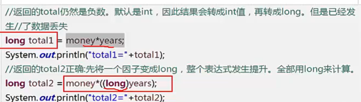

自增 子
int b = 3
int a = b++ 先赋值再自增
int a = ++b 先自增再赋值

逻辑与 & 两个都为true 结果才位true 否则是false

逻辑或 | 两个操作有一个操作数是true 结果就是true

短路与 && 只要有一个为false 则直接返回false

短路或 || 只要有一个为true 则直接返回true

逻辑异或 ^ 

非 !

位运算符，位运算指的是进行二进制运算

~ 按位取反 
& 按位与 
| 按位或 
^ 按位异或 
<< 左移运算符 
\>\> 右移运算符 
左移等同于*2 
右移等同于/2

字符串连接符 

char类型使用+链接会返回两个char的ascii的值之和
使用字符串连接符的条件是两个字符串

条件运算符 三目运算符  
conditions?valueA:valueB
条件运算符可以用于赋值

通常可以用于代替if else

运算符优先级  不需要全部掌握，了解大概就ok,复杂表达式用()组织优先级问题
                  

ps: char (0-65535)

浮点数不精确，虚线表示转换的时候会有精度损失

类型转换 casting

超出目标类型的表数范围 就会截断成一个完全不同的值

操作大数的时候 注意是否有溢出
直接相乘会出报错

 解决方法：

或者 long total2 = 1L*money*years

定义long类型 在数字末尾加上L，不要使用小写  “l”，会导致l看成 “1”

键盘输入Scan

import java.util.Scanner; 
Scanner scanner = scanner.nextLine();

scanner创建了一种阻塞

overload 方法重载 overload 
1. 相同的函数名，形参的类型个数和顺序不同
2. 只有返回值不同不构成函数的重载
3. 只有形参的名称不同不构成函数重载

