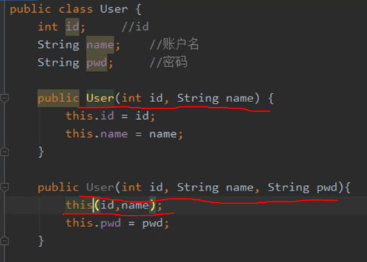
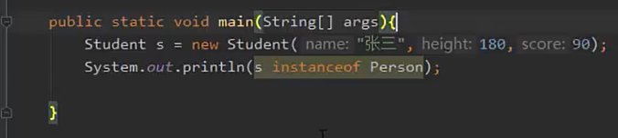

**Java OOP**

思考表格和instance

* OOD面向对象设计
* OOA面向对象分析
* OOP面向对象编程
* 面向过程是一种执行者思维 解决简单的问题可以通过面向过程
* 面向对象是一种设计者思维 解决复杂需要协作的问题可以使用面向对象
* 面向对象离不开面向过程
  * 宏观上 通过面向对象进行整体设计
  * 微观上 执行和处理数据仍然是面向过程
  

属性 成员变量 

构造函数四个要点
1. 通过new使用
2. constructor 有返回值 但是不能定义返回值
3. 如果没有定义返回值，编译器回自己定义一个无参构造函数；如果已定义则不会自动添加
4. constructor的函数名必须和类名一致

OOP 内存分析
1. 虚拟机内存模型

2. 执行过程中的内存分析
3. 参数传值机制

垃圾回收
1. 原理和算法
2. 分代垃圾回收机制
3. JVM调优和FUllGC
4. 内存泄漏
   
static this
1. this
2. static
3. 静态初始化块
   
包机制
1. package
2. import
3. static import

 

1. 线程计数器 记录当前线程正在执行的Java方法的jvm指令地址，即字节码行号。如果正在执行native 方法 则计数器为空
2. java虚拟机栈 java virtual machine stack，线程私有区，每个线程创建的时候都会创建一个虚拟机栈，生命周期和线程一直。线程退出，线程虚拟机栈也被回收。虚拟机内部会保持一个个的栈帧，每次方法调用都会进行压栈。JVM对于栈帧的操作只有进栈和出栈两种。方法调用结束时会进行出栈操作。该区域村住着局部变量表，编译时期可知的各种基本类型数据，对象引用方法出口信息等。
3. 本地方法栈与虚拟机栈类似（native method stack），本地方法栈是在调用本地方法时使用的栈 每一个线程都有一个本地方法栈。
4. 堆，几乎是所有的Java对象实例都是费配到堆上。堆被所有线程共享。在对上的区域会被垃圾回收机制做进一步划分
5. 方法区， method area, 所有线程共享 存储不变的数据. 方法区是一种java虚拟机的规范。JDK8之后永久代不存在，编译后的代码移动到了元空间 metaspace中。 3
6. 常量池
   1. 字面量 文本字符 final常量值
   2. 符号引用
7. 直接内存

虚拟机栈
1. 栈描述的是方法执行的内存模型。每个方法被调用都会创建一个栈帧。存储局部变量，操作数，方法入口。
2. JVM为每个线程创建一个栈，用于存放该线程执行方法的信息（实际参数，局部变量）
3. 栈属于线程私有，不能实现线程间的共享. (有疑问)
4. 栈 filo first in last out
5. 栈有系统自动分配。是一个连续的空间
   

堆得特点
1. 用于存储创建好的对象和数组，数组也是对象
2. JVM只有一个堆，所有线程共享
3. 堆是一个不连续内存空间，费沛灵活速度慢

方法区
1. 方法区是Java的虚拟机规范 有不同的实现方法
2. jvm只有一个方法区 被所有线程共享
3. 方法区实际上也是堆，用于存储类 常量相关信息

Garbage Collection
1. Java内存管理很大程度指的是对中对象的管理，其中包括对象空间的分配和释放
   1. 对象空间的分配 使用new关键字创建对象
   2. 对象空间的释放 赋值null即可，垃圾回收期将负责回收所有不可达的对象的内存空间
2. 垃圾回收过程
   任何一种垃圾回收算法都要做到两件基本事情
   1. 发现无用对象
   2. 回收无用对象的内存空间
    
   垃圾回收机制保证可以将无用对象进行回收 无用对象指的是没有任何变量引用该对象，java垃圾回收期通过相关算法发现无用对象，进行清除和整理
3.  垃圾回收相关算法
    1. 引用计数法 记录引用的数量 引用值为0，则无人使用，则进行回收。缺点是循环引用的无用对象无法识别
    
    2. 引用可达法
      利用图算法实现。从一个GCroot开始，寻找对应的引用节点，找到该节点后继续寻找这个节点的引用节点，当所有引用节点寻找完毕后，剩余的节点将被视为无用节点。

分代垃圾回收机制
1. 年轻代 Eden区 存储了从未通过垃圾回收的新对象
2. 年老代 Survivor区 存放垃圾回收之后仍然有用的对象 循环存放小于15次垃圾回收次数 
3. 永久代 Tenured区 年老代区域存放超过15次垃圾回收的对象

Minor GC: 用于清理年轻代区域，Eden区存满了就会触发一次Minor GC，清理无用对象，将所有有用对象赋值到Survivor1 Survivor2区中

Major GC: 用于清理年老代区域

Full GC： 用于清理年轻代，年老代区域。成本较高，对于系统性能产生影响

垃圾回收两个步骤 1. 发现垃圾 2. 回收垃圾

垃圾回收两种方法 1.引用计数法 2. 根搜索法

堆内存划分 年轻代，老年代 永久代。 立即回收期划分成 Minon GC, Major GC; Full GC. 

MinorGC Eden

MajogGC Survivor

FullGC Eden,Survivor，Tenured

System.gc() 建议调用 FullGC

this
1. 在容易产生二义性的地方，用this指代当前对象；普通方法中，this指向调用用该方法的对象，构造方法中this总是指向当前初始化的对象
2. 使用this关键字调用重载的构造方法，避免相同的初始化代码，但只能在构造方法中使用，且必须位于构造方法的第一句
   
3. this不能用于static方法中

Static 再类中 用static生命的变量成员为静态变量成员。也成为了类变量。类变量生命周期和类相同。在整个应用程序执行期间都有效。有如下特点
1. 为该类的公共变量，属于类，被该类的所有实例共享，在类被载入时显式初始化
2. 对于该类的所有对象来说，static成员变量是有一份，被所有对象共享
3. 一般用 类名.变量名/方法名 调用 也可以通过对象引用或类名访问静态成员
4. 在static方法中不可直接访问非static的成员
   
静态初始化块
构造方法用于对象的初始化，静态初始化块，用于类的初始化操作，在静态初始化块中不能直接访问非static成员

静态初始化块的执行顺序
1. 上诉到Object类 限制性object的静态初始化块，在乡下执行子类的静态初始化块，直到类的静态初始化块为止
2. 构造方法执行顺序和上面的顺序一样

Java包机制 package 
管理类 相似的放一起 包名有要求
1. 通常是类的第一句飞猪实行语句
2. 包名 域名倒着写即可 再加上模块名 便于内部管理类

Java 常用包
*  java.lang String, Math, Interger, System, Thread ..
*  java.awt GUI开发
*  java.net 网络相关操作
*  java.io 输入输出流
*  java.util 一些实用工具类，时间 日历

import
导入类
遇到重名的类 写全名
例如：
      
      java.util.Date
      java.sql.Date

静态导入 用于导入指定类的静态属性.

继承 extends
代码复用 类的拓展

继承的几个要点
1. 父类也成超类 基类 派生类
2. java中只有单继承。
3. java中接口可以多继承
4. 自雷继承父类可以得到父类的所有属性和方法（除了父类的构造方法） 但是不见得可以直接访问，比如说父类的私有属性和方法
5. 如果定义一个类式 没有调用extends 则它的父类是 java.lang.Object

判断instance 是否属于某个class

方法重写 override
子类通过重写父类的方法，可以用自身的行为替换父类的行为。方法重写是实现多态的必要条件。方法重写符合以下三个要点：
1. 方法名 形参列表相同
2. 返回值类型和声明异常类型 子类小于等于父类
3. 访问权限 子类大于等于父类

关键字 final（不可更改 不可拓展）
1. 修饰变量，被修饰的变量不可变
2. 修饰方法 方法不可重写但可以重载
3. 修饰类，类不可继承
4. 父类中的final方法可以被继承 但是不能被重写