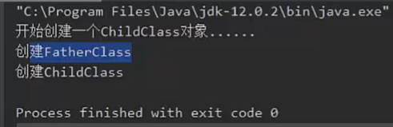

继承和组合 组合比继承更灵活。组合就是在一个类中写另一个类的对象。如下图

is-a关系(student is a person) 用继承

has-a关系(student has a person) 用组合

IDEA 
1. alt+7 查看类结构
2. alt+左键 源码
3. 光标放在类名上 右键diagram查看源码
4. alt+insert自动生成 constructor, equals(), toString()

Object类 所有Java类的父类

toString() 原始 class+address

equals() 和 ==
* == 判断两个对象是否同一个对象
* equals 判断两个对象逻辑上的值是否一样
* 重写equals的例子
  

关键字 super 
1. 可以看做直接父类对象的引用。可以通过super访问父类中被子类覆盖的方法或属性。
2. 使用super调用普通方法，语句没有位置限制，可以在子类中随便调用
3. 若构造方法的第一行代码没有显式的调用super或者this，java默认都会调用super，含义是调用父类的无参构造方法，这里的super可以省略

继承树的追溯

1. 属性/方法查找顺序（比如说查找属性h）
   * 查找当前类中有没有属性h
   * 依次上溯每个父类查看父类中是否有h直到object
   * 如果没有找到，编译错误
   * 上面的步骤 只要找到了h变量，整个过程终止
2. 构造方法的调用顺序。
   构造方法的第一句总是 super()来调用父类对应的构造方法。所以流程是线向上追溯到Object，然后依次向下执行类的初始化块和构造方法，直到当前子类为止  

   静态初始化块的调用顺序与构造方法调用顺序一样

封装 encapsulation
**高内聚 低耦合**

封装就是把对象的属性和操作结合为一个独立的整体，尽可能隐藏对象内部的实现细节

封装的具体优点
1. 提高代码安全性
2. 提高代码复用性
3. 高内聚： 丰庄西街，便于修改内部代码，提高可维护性
4. 低耦合：简化外部调用，便于调用者使用，便于拓展和协作

封装的简单规则
1. 一般使用private访问权限
2. 属性私有后 提供相应的get set方法来访问属性，这些方法通常用public修饰。已提供对于属性的赋值和读取操作
3. 方法：一些只用于本类的辅助性方法可以用private修饰，希望其他类调用的方法用public修饰
   

**多态 polymorphism**

多态的意思 多种形态。同一个方法的调用，由于对象不同，可能有不同的行为。

多态的要点：
1. 多态是方法的多态 不是属性的多态， 多态与属性无关
2. 多态的三个必要条件 继承 方法的重写 父类引用指向子类的对象
3. 父类引用指向子类对象后，用该父类引用调用子类重写的方法，此时多态就出现了
4. 程序更加灵活，如果没有多态，多次的重载，重写会复杂程序设计。

Polymorphism Example. 在这个例子中，dog cat继承了animal。在test class中输出动物叫。aminamcry的参数为父类animal。当参数值为子类，会自动转型为对应的子类，然后调用对应的函数。但是如果没有使用多态，则达到同样的结果需要重载animamcry，更改入口参数的类型。如果后期要增加不同的动物叫，则需要添加更多的动物叫函数重载。不利于程序的维护和拓展开发。

向上转型后的父类引用只能调用她的变异类型方法，不能调用它的运行时类型的方法。这是就需要类型转换。称之为向下转型。

向下转型 必须将引用变量转换成真是的子类类型（运行时类型）否则会出现类型转换异常 ClassCastException。

为了避免这种异常可以通过instanceof运算符进行检查

**多态总结** 

1. 同一个方法调用的时候传入不同的对象 可能会调用不同对象的方法
2. 这些对象对应的子类重写了父类的方法
3. 三个必要条件 继承 重写 父类引用指向子类对象
4. 类型转换，编译通过只是进行语法检查。编译成功不代表程序没有bug。

