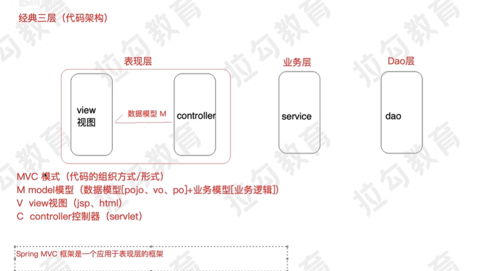

Spring MVC 简化的web开发框架

Spring MVC 是什么

相关度高的归为一层 

代码架构与MVC

经典三层 系统划分

MVC 设计模式(代码的组织形式)

M   model 模型 (数据模型[pojo, vo, po] + 业务模型[业务逻辑])

V   view 视图 （jsp html）

C   controller 控制器 （servlet）

Spring MVC 应用于表现层的框架

SpringMVC 全名Springweb MVC 是一种基于java的实现MVC设计模型的请求驱动类型轻量级web框架 属于springframework的后续产品

SpringMVC本质可以认为是对servlet的封装 简化了servlet的开发
作用
1) 接受请求
2) 返回响应 跳转页面