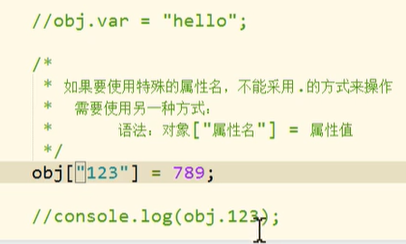

JavaScript包含了ECMASCript DOM BOM.

DOM Documenmt object model

BOM Broswer object model

JS特点
1. 解释型语言
2. 类似C和Java的语法结构
3. 动态语言
4. 基于原型的面向对象
   

JS基本数据类型 
* String 字符串
* Number 数值
* Boolean 布尔值
* Null 空值
* Undefined 未定义
* 以上五种属于基本数据类型只要不是上面五种 剩下的全部都是对象
* Object 对象
  
基本数据类型，单一的值，数值之间没有联系

对象是一种复合的数据类型 对象中可以保存不同数据类型的属性

对象的分类
1. 内建对象，任何实现都能使用  Math, String Number Boolean Function Object ...
2. 宿主对象   由JS的运行环境提供的对象，目前来讲主要指的是由浏览器提供的对象 比如说BOM和DOM
3. 自建对象  有开发人员自定义的对象

对象中添加属性
1. 属性名 
    * 对象的属性名不强制要求遵守标识符的规范，什么乱七八糟的都行
    * 但是尽量要求按照标志符的规范去做
    * 如果要使用乱七八糟的属性名，不能采用 . 方式访问。需要使用 对象["属性名"] 的方式访问
    * 
2. 属性值
   * JS对象属性值可以使任意数据类型
   * 甚至可以使一个对象 

in  运算符。 通过该运算符检查一个对象中是否含有指定的属性。有 返回true，否则 false

语法 属性名 in 对象

