# React

用于构建用户界面的 JavaScript 裤

React 是一个将数据渲染为 HTML 视图的开源 JavaScript 裤

组件化/模块化

**特点**

1. 组件化 声明式编码 提升开发效率和组件复用率
2. react native 可以写移动端开发
3. 虚拟 DOM+优秀的 Diffing 算法，尽量减少真是 DOM 的交互

JSX makes writing virtual dom more easier

关于虚拟 dom

1. 本质是 Object 类型的对象
2. 虚拟 DOM 比较“轻”，相比如真实 DOM，因为虚拟 DOM 是 react 内不再用，所以无需使用真实 DOM 上那么多的属性
3. 虚拟 DOM 最终会被 React 转化为真实 DOM，呈现在页面上

XML 存储数据和传输数据的一种方式<br>
后来发现 JSON 好像更牛逼<br>

JSON parse 和 stringfy

关于 JSX

1. 全程 JSX
2. react 定义的一种类似 XML 的 JS 拓展与法
3. 本质上是 React.createElement(component，props,....)的语法糖
4. 作用 用于创建虚拟 DOM
   1. 写法 var ee = \<h1\>hello JSX \</h1\>
   2. 注意事项：
      1. 他不是字符串也不是 HTML/XML 标签
      2. 他最终产生的将是一个 JS 对象
5. 标签名任意：HTML 标签或者其他标签

JSX 语法规则： 1. 定义虚拟 DOM 时，不要写引号 2. 标签中混入 JS 表达式时 使用{}引入 3. 样式类名不用 class 用 className. class -> className 4. 内联样式需要用 style={{key:value}}的形式去写 5. 虚拟 DOM 不能有多个根标签，只能有一个根标签 6. 标签必须必和 \<input type="text" /\> 7. 标签首字母
(1) 小写字母开头， 则将标签转换为 html 中同名元素，若 html 中无改标签同名元素，则报错
(2) 若大写开头，react 就去渲染该组件，若组件未定义，则报错

JS 表达式
JS 语句（代码）
<br>

Javascript 模块

1. **_向外提供特定功能的 js 程序，一般就是一个 js 文件_**
2. 随着业务逻辑增加，代码越来越复杂
3. 复用 js，简化 js 程序编写 提高运行效率
   <br>

组件

1. 理解 **_用来实现局部功能效果的代码和资源的集合_**
2. 一个界面功能更复杂
3. 复用 编码 简化项目编码 提高运行效率

<br>
模块化： 当应用的js都已模块来编写，这个应用就是一个模块化的应用<br>
组件化：复杂的功能以组建来实现 这个应用就是一个组件化的应用<br>

函数式组件，用函数定义，适用于简单组件的定义。<br>

1. **_函数式组件 函数必须开头大写。_**
2. **_组件必须用标签 </>_**

类式组件，用类定义，适用于复杂组件的定义<br>

在实验中,使用到了 babel。经过 Babel 翻译的 jsx 会进入严格模式(ES5 strict mode)
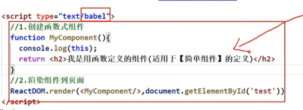
(ES5 严格模式 strict mode 禁止自定义函数的 this 指向 window)

关于 JavaScript class 的三点

1. constructor 不是必须写的,需要实例化的时候才写
2. 关于 super，如果 a 类继承 b 类且 a 中有构造器，那么 a 类构造器中 super 必须被调用
3. 类中定义的方法 都是放在了类的原型对象上

类式组件

1. 继承父类 react component
2. 必须有 render
3. render 必须有返回值

render()放在哪里？ MyComponent 的原型对象放在类中 供实例使用。
render()中的 this 是谁? MyComponent 的实例对象，MyComponent 组件实例对象

执行了 ReactDOM.render(....)后发生了什么？

1. React 解析足见标签 找到了 MyComponent 组件
2. 发现组件是使用类定义的，随后 new 该类的实例，并通过该类的实例调用到圆形 render 的方法
3. 将 render 返回的虚拟 dom 转化为真实 dom，随后呈现在页面中

什么事复杂组件？
有状态（State）就是复杂组件

什么是状态（state）？

组件的状态驱动着页面。 => 数据在状态里。状态中的数据驱动叶绵绵的展示

组件实例的三大核心属性 State

1. 理解
   1. state 是组件对象最重要的属性，值是对象，可以包含多个 key-value
   2. 组件被称为“状态机”，通过更新组建的 state 来更新页面的显式（重新渲染组件）
2. 注意
   1. 组建中 render 方法中的 this 为组建的实例对象
   2. 组件自定义的方法中 this 为 undefined 如何解决？
      1. 强制绑定 this，通过函数兑现个的 bind()
      2. 箭头函数
3. 状态数据 不能直接修改或者更新

Props 传递参数

1. class 中调用 this.props.variablename
2. function 中调用 props.variablename

Destructuring the props and state

1. in function, destructuring in function variable <br>
   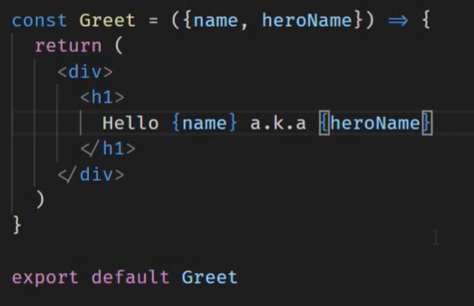<br>
2. destructuring in body<br>
   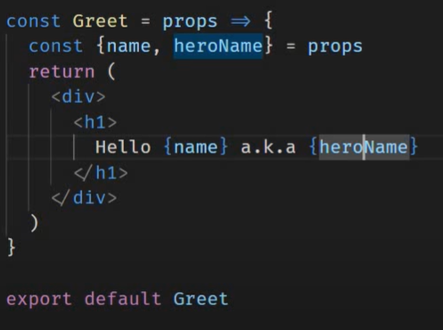<br>
   3.destructuring in class<br>
   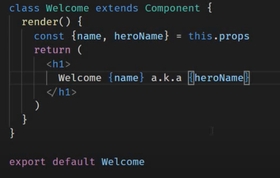<br>
   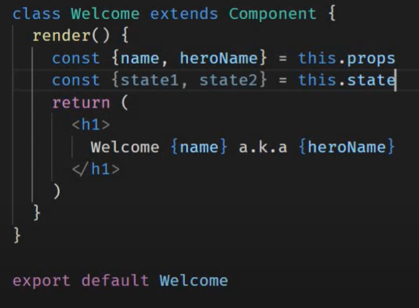<br>

click in Functional Components

1.  do not put () in {}
    what should is as below

         function FunctionClick() {
             const fun = () => {
                 console.log("caonimalegebi")
             }
             return (
                 <div>
                     <button onClick={fun}>
                         func
                     </button>
                 </div>
             )
         }

2.  这两种写法都 ok
    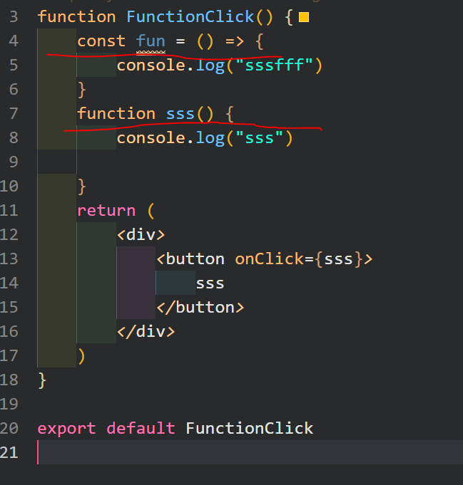

3.  Class Component 中写记得加上 this example 如下图
    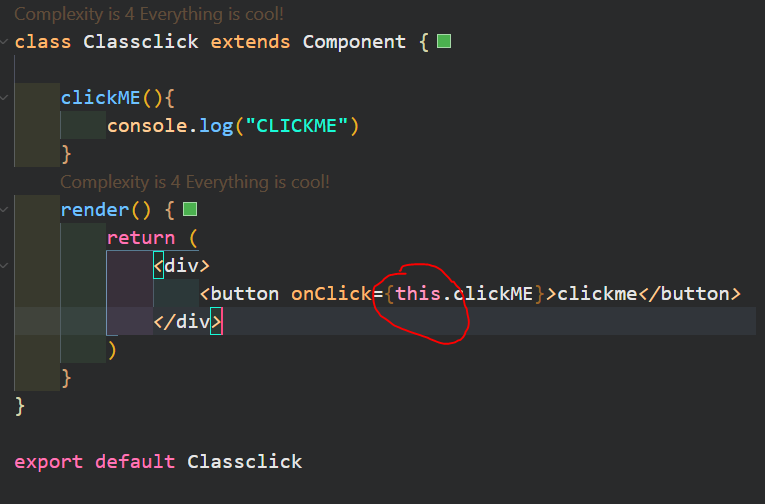

Event binding in React

    // write in class
    mtheod 1-3
    changeMsg() {
        this.setState({
            msg: "goodbye"
        })
    }

    method 4 in official tutorial
    clickmsg = ()=>{
        this.setState({msg:"bye"})
    }

- method 1

        // write in render()
        <button onClick={this.changeMsg.bind(this)}>click</button>

- method 2

        // write in render()
        <button onClick={this.changeMsg}>click</button>

- method 3

        // write in render()
        <button onClick={()=>this.changeMsg()}>click</button>

- method 4

        // write in render()
        clickmsg = ()=>{this.setState({msg:"bye"})}

What are the differencs between using binding adn arrow function???

Passing Component to component

setting parameters or props. In the image below, the function is passed as param. The _greetHandler_ is functioned as param name, the param content or value is the function _this.greetparent_.

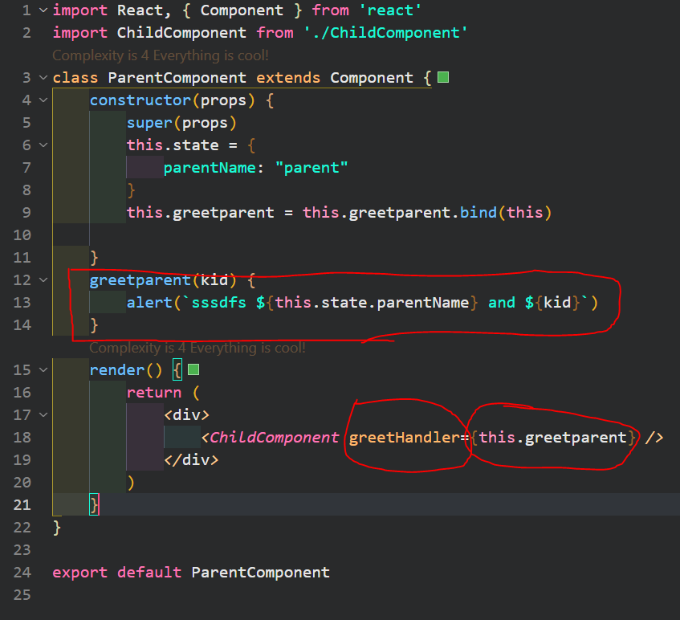

The image below is child component which is called to make a button and call the _greetparent_ function. This component takes the parent component's input as event to be triggered and it will also insert _"KID"_ to tell it from child component.

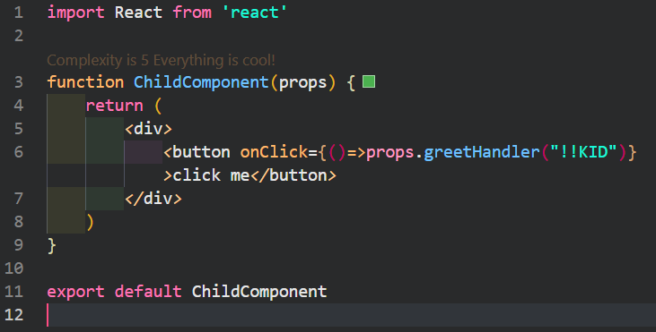

The flow of how this work can be described as below.


**Lists and Keys**

When rendering list, remember render the key too. The updates of data is based on the key attribute. Key is a must for react.

1. A "key" is a special string attribute you need to linclude when creating lists of elements.
2. Keys give the elements a stable identity
3. Keys help react identify which items have been changed, added or removed
4. Help in efficient update of user interface

**Index as key**

Problems: when using index as key, there will not have huge difference if we add some elemenmts at the tail. However, there might cause problems when insert at the head.

**Example**

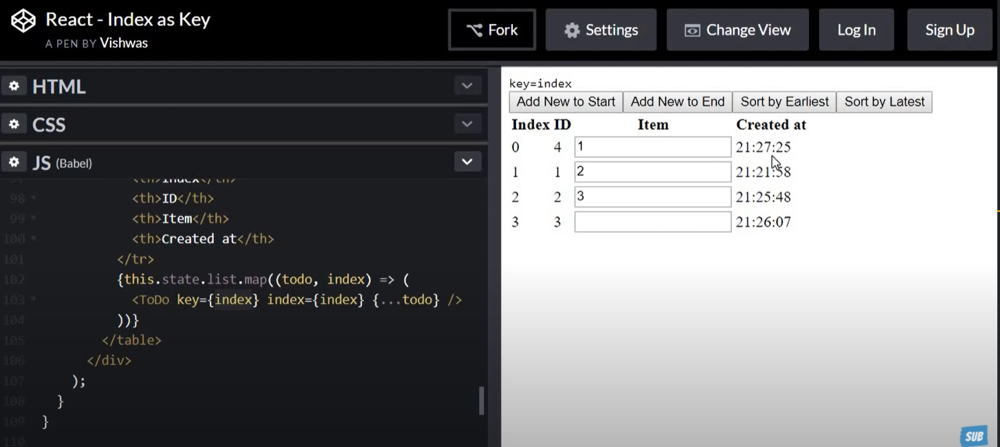

In the image above, we want to update the data by insert at the head. But when react read the data we want to insert, it compares the origin with current one we have, that is reusing the data.

As we human being, we might think the data should shift down if we add at the beginning. However, react will just reuse the data.

In another word, the key and the value itself, do not have a strong relationship. This situation is more vivid when making the todo using this link (https://codepen.io/gopinav/pen/gQpepq).

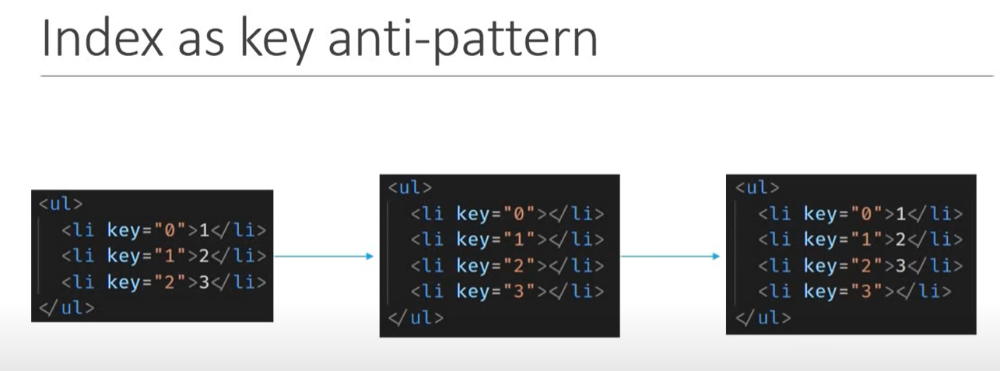 
 
Index as key

When to use index as a key?

1. The items in your list do not have a unique id
2. The list is static and will not chage
3. The list will never be reordered or filtered

Stying React Components

1. CSS stylesheets
2. inline stying
3. CSS modules

Mounting Lifecycle Methods

1. constructor(props)
   1. A special functiont hat will get called whenever a new component is created
   2. initializing state, binding the event handlers
   3. what you should not do: do not cause side effects like http requests
   4. super(props), directly overwrite this.state
2. static getDerivedStateFromProps(props,state)
   This is a rarely used lifecycle method
   1. this mehtod is used when the state of components depends on the changes in props over time
   2. this method is used to get the props and set the state
   3. this method is static, so you cannot use this to call it
   4. what you should not do: do not cause side effects like http requests
3. render()
   1. only required method
   2. read props and states and return jsx
   3. what you should not do: do not change the state or interact with DOM or make ajax calls
   4. The childern components lifecycle methods are also executed.
4. componentDidMount()

   componentDidMount() is invoked immediately after a component is mounted (inserted into the tree). Initialization that requires DOM nodes should go here. If you need to load data from a remote endpoint, this is a good place to instantiate the network request.

   1. This mehod will be invoked once of a given component and Invoked immediately after a component and all its children components have been rendered to the DOM
   2. this mehthod is a good palce to perform initialization that reqiures DOM nodes and also load data by making network requests. The side effects: ex: interacting with dom and perfrom any ajax calls to load data

Updating lifecyclye methods

1. static getDerivedStateFromProps(props,state)
   - return null or an object to represent the updated state of the component. Method is called every time a component is re-rendered.
   - this method is used when the states depends on the props of the component
   - you should not cause any side effect and get odd state from props
   - rarely used
2. shouldComponentUpdate(nextProps, nextState)
   - Dictates if the component should re-render or not
   - by defalut, all class components will render whenever the propos or their state changes
   - This method can prevent that defalut behavior by return false
   - Performance Optimization
   - Should not cause side effects like http requests
3. render()
   1. only required method
   2. read props and states and return jsx
   3. what you should not do: do not change the state or interact with DOM or make ajax calls
   4. The childern components lifecycle methods are also executed.
4. getSnapshotBeforeUpdate(prevProps,prevState)
   1. called right before the changes from the virtual DOM are to be relected in the DOM
   2. rarely used
   3. used to capture information of DOM
   4. This method will either return null or return a value. Returned value will be passed as the third parameter to the next method.
5. componentDidUpdate(prevProps,prevSate,snapshot)

   componentDidUpdate() is invoked immediately after updating occurs. This method is not called for the initial render.

   1. called after the render is finished in the re-render cycles
   2. this method is garanteed to be called only once in each rerender cycle
   3. make ajax calles

shouldComponentUpdate(nextProps, nextState)

- Dictates if the component should re-render or not
- by defalut, all class components will render whenever the propos or their state changes
- This method can prevent that defalut behavior by return false
- Performance Optimization
- Should not cause side effects like http requests

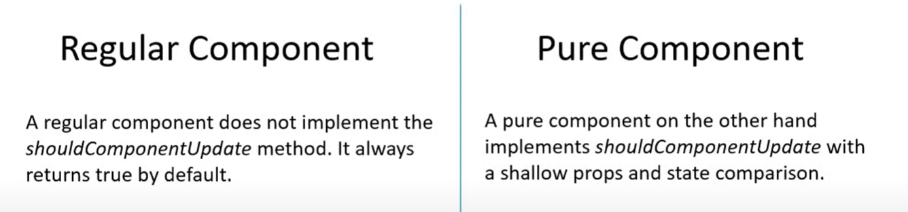

 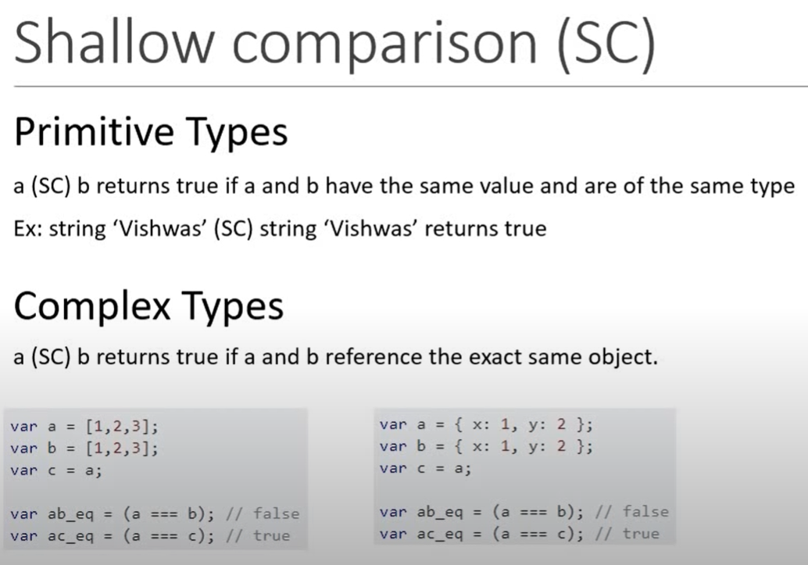 
 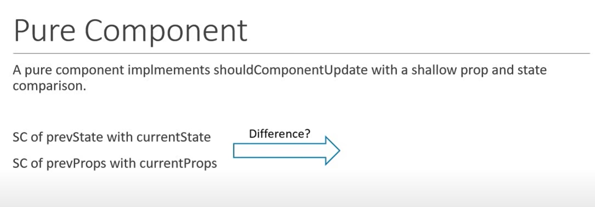

always rerender an new object or array when using purecomponent

Summary for the PureComponent

1. We can create a component by extending the PureComponent Class
2. A PureComponent implements the shouldComponentUpdate lifecycle method by performing a shallow comparison on the props and state of the component
3. if there is no difference, the component is not re-rendered - performance boost
4. its a good idea to ensure that all the children components are also pure to avoid unexpected behaviors.
5. Never mutate the state. Always return a new object that reflects the new state

Fragments, wrap the contenst without using <> or \<div\>.
div cannot hold some special contents like table td contents

PureComponents will only rerender the class components when there is a difference in shallow comparison of props and states. it uses shouldComponentUpdate with shallow prop and state comparison.

Shallow comparion can be understood as value compariosn instead of reference comparison

memo components is the purecomponents for the functional components

Ref forwarding is a technique for automatically passing a ref through a component to one of its children.

// Ref a method to access dom node

Ref forwarding 用于在父组件中操作子组件中的 dom 节点

组件内的标签可以定义 ref 属性来标志自己

the tag inside the component can be tracked by using ref

Three types of writing refs

1.  string refs
    1. ref="xxx"
2.  function refs.
    在下图实例中，ref 的回调函数输出的值是当前 input tag，a 就是当前 ref 所在节点。a 作为当前 ref 所在节点，赋值给了 demo 实例的 input1 属性
    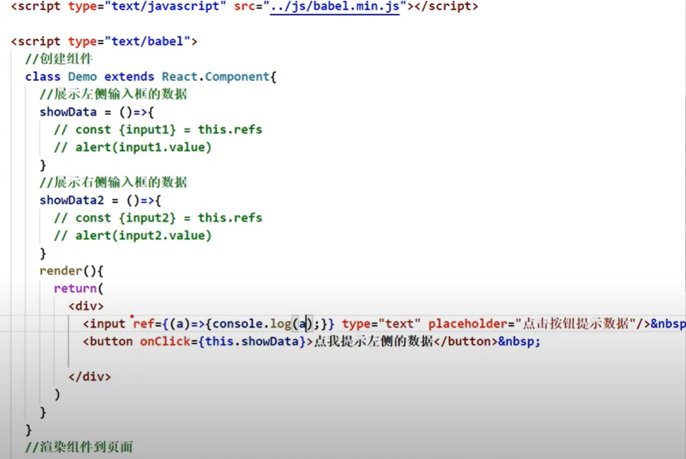

             class NonStringRef extends Component {
             clickhandler = () => {
                 console.log("@")
                 console.log(this)
             }
             showdata1 = () => {
                 const { input1 } = this
                 alert(input1.value)
             }

             showdata2 = () => {
                 const { input2 } = this
                 alert(input2.value)
             }
             render() {
                 return (
                     <div>
                         <input ref={currentNode => { this.input1 = currentNode }} type="text" placeholder="focus and display data" />&nbsp;
                         <button onClick={this.showdata1}>click</button> &nbsp;
                         <input ref={currentNode => { this.input2 = currentNode }} onBlur={this.showdata2} type="text" placeholder="los focus and display data" /> &nbsp;
                     </div>
                 )
             }
         }

    回调式函数 ref，callback ref。回调式 ref 会执行两次当更新的时候。

         官方说法：
         If the ref callback is defined as an inline function, it will get called twice during updates, first with null and then again with the DOM element. This is because a new instance of the function is created with each render, so React needs to clear the old ref and set up the new one. You can avoid this by defining the ref callback as a bound method on the class, but note that it shouldn’t matter in most cases.

    解释和例子
    下方的代码例子是点击改变成 hot 或者 cold。第一次页面正常渲染，实例对象被 render 调用然后渲染到页面。但是第二次使用的时候，会替换掉之前的 ref，更新一个新的 ref，所以会额外产生一个 null。这种不明显的错误绝大部分时间不会产生致命的影响。

         class FuncRef extends Component {

             state = { isHot: true }

             showInfo = () => {
                 const { input1 } = this
                 alert(input1.value)
             }

             changeWeather = () => {
                 this.setState({ isHot: !this.state.isHot })
             }
             render() {
                 return (
                     <div>
                         <h1 onClick={this.changeWeather}>Today is {this.state.isHot ? "hot" : "cold"}</h1>
                         <input ref={(currentNode) => { this.input1 = currentNode; console.log("@", currentNode) }} type="text" />&nbsp;
                         <button onClick={this.showInfo} >click</button> &nbsp;
                     </div>
                 )
             }
         }

         export default FuncRef

    针对额外产生的 null，在使用 callback function 时，解决办法就是把写在 tag 中的内联函数写到外头去，以下为示例

         class NonStringRef extends Component {
             clickhandler = () => {
                 console.log("@")
                 console.log(this)
             }
             showdata1 = () => {
                 const { input1 } = this
                 alert(input1.value)
             }

             showdata2 = () => {
                 const { input2 } = this
                 alert(input2.value)
             }
             render() {
                 return (
                     <div>
                         <input ref={currentNode => { this.input1 = currentNode }} type="text" placeholder="focus and display data" />&nbsp;
                         <button onClick={this.showdata1}>click</button> &nbsp;
                         <input ref={currentNode => { this.input2 = currentNode }} onBlur={this.showdata2} type="text" placeholder="los focus and display data" /> &nbsp;
                     </div>
                 )
             }
         }

         export default NonStringRef

3.  create ref

    会用 React.createRef()相对于回调函数 callback 的方式略嫌麻烦，需要几个 ref 就得 create 几个 ref。这是 react 官方最推荐的 ref 书写形式。没有之一。

        class RefCreateRef extends Component {
            // React.createRef() 调用后可以返回一个容器，该容器可以存储被ref表示的节点，该容器“专人专用”。只能存一个。多次反复存储会产生覆盖。
            myRef = React.createRef();
            myRef2 = React.createRef();

            showData = () => {
                // current is fixed current是固定的属性 不能更改
                // console.log(this.myRef.current.value)
                // const { input1 } = this
                alert(this.myRef.current.value)
            }
            showData2 = () => {
                // const { input2 } = this
                // alert(input2.value)
                alert(this.myRef.current.value)
            }

            render() {
                return (
                    <div>
                        {/* input is storeed in myRef */}
                        <input ref={this.myRef} type="text" /> &nbsp;

                        <button onClick={this.showData} >click</button> &nbsp;

                        <input onBlur={this.showData2} ref={this.myRef2} type="text" />

                    </div>
                )
            }
        }

        export default RefCreateRef

Ref summary

1. 字符串 ref 尽量避免 ref 除非条件不允许
2. 回调式 callback
3. createRef()

Call back 常用 23 都是 ok 的。

事件

1. 通过 onXXXX 属性指定的事件处理函数
   1. Reack 使用的是自定义事件，而不是原生 DOM 事件，这是为了更好的兼容性
   2. React 中的事件是通过事件委托的方式处理（委托了给了最外层元素），这是为了高效。
2. 通过 event.target 得到发生事件的 DOM 元素对象 react 官方提示，不要过分使用 ref

Controlled Component
页面中所有输入类的 DOM，随着输入可以把值维护到 state 中，等需要使用时，将值从 state 中取出 这就是受控组件。Controlled component

Un-Controlled Componnet
随用随取

官方说法

        Uncontrolled Components

        In most cases, we recommend using controlled components to implement forms. In a controlled component, form data is handled by a React component. The alternative is uncontrolled components, where form data is handled by the DOM itself.


        Controlled Components
        In HTML, form elements such as <input>, <textarea>, and <select> typically maintain their own state and update it based on user input. In React, mutable state is typically kept in the state property of components, and only updated with setState().

        We can combine the two by making the React state be the “single source of truth”. Then the React component that renders a form also controls what happens in that form on subsequent user input. An input form element whose value is controlled by React in this way is called a “controlled component”.

下面一段代码想要达到的目的是 1.输入 uname passwd;2. 存入 state 中
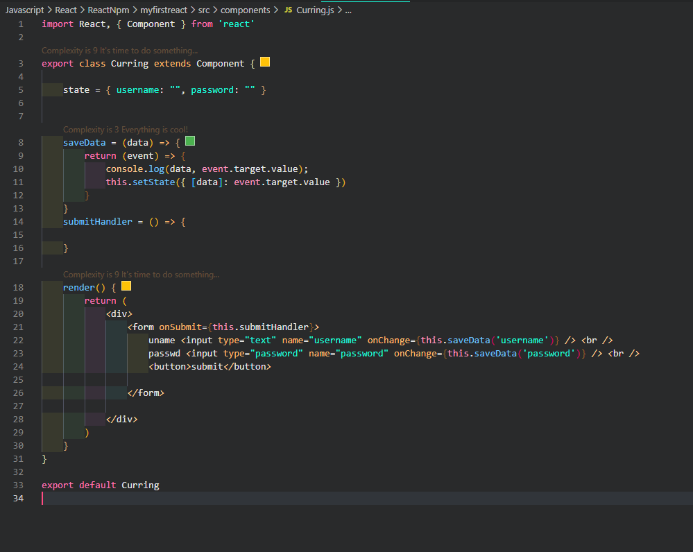

分析：

1.  有两种存储 input data 到 state 中的方法 一个是每一个 input 写一个 setState，另一个是利用 currying
2.  第一种方法 每一个 input 写一个 setState，虽然效果区别不大，但是很麻烦。如下所列，passwd，uname 需要个写一个。如果是普通的登录倒还好，如果是注册需要填写大量数据，那这种方法就很笨拙

        saveUname = (event) => {
            this.setState({ username: event.target.value })
        }

        savePasswd = (event) => {
            this.setState({ password: event.target.value })
        }

3.  利用 function currying 可以将多个 save setState 合为一个。上图的一些细节问题
    1. onChange 需要的是一个函数 而不是函数返回值
    2. 利用 currying，返回的将会是一个 function 而不是一个 value，所以通过使用 currying 的方式写函(return)可以实现目的
    3. 上图中 saveData()中的 data，这个 data 在传值的时候扮演的是一个 string 的角色，也就是说我们如果 setState 中写的 data，不会对应为 password 或者 username，他将会被创建为一个新的字段 data。所以这里不能直接写一个 data 上去，需要在 data 外头加上[]进行包裹
4.  但是，通过对于 onChange 的分析，我们可以得出一个结论，即 onChange 需要的是一个函数而不是一个值。arrow function 箭头函数就可以被纳入考虑。如下面代码块所示，将 onChange 的函数写成 arrow function 也可以达到目标。并且此时不需要 currying

        saveData2 = (data, value) => {
            this.setState({ [data]: value })
        }

        uname <input type="text" name="username" onChange={(event) => this.saveData2("username", event.target.value)} /> <br />

高阶函数：如果一个函数符合下面两个规范中的任何一个，那么他就是高阶函数

1. 若函数 A，接收的参数是一个函数，那么 A 就可以称之为高阶函数
2. 若函数 A，调用的返回值依旧是一个函数，那么 A 就可以称之为高阶函数
3. 常见的高阶函数 Promise SetTimeout array.map

函数 currying 通过函数调用继续返回函数的方式，实现多次接收参数后统一处理的函数编码形式

        一个简单的currying

        function sum(a){
            return (b)=>{
                return (c)=>{
                    return a+b+c
                }
            }
        }

        sum(1)(2)(3)

组件生命周期

Mount: 第一次被 render 到 page 上
Unmount: 组件被移除成为 unmount

Render 调用的次数 1+n。第一次渲染 render 到页面，后面没更新一次 state 就需要 render 一次

在关键点调用特殊函数完成特殊的任务。生命周期回调（钩子）（函数），react 会帮你调。

componentDidMount()

componnetWillUnmount()

关于生命周期

1. 组件从创建到死亡会经历一些特定的阶段
2. React 组建中包换一系列钩子函数（生命周期回调函数），会在特定时间点调用
3. 在定义组件时，会在特定的生命周期回调函数中做特定的工作

LifeCyclye

强制更新，forceUpdate()，不受到 shouldComponentUpdate()限制

旧生命周期总结

1. 初始化阶段：由 ReactDOM.render 触发，初次渲染
   1. constructor()
   2. componentWillMount()
   3. render()
   4. componnetDidMount()==>常用 一般在这个钩子中做一些初始化的事儿。例如开启定时器，发送网络请求，订阅请求
2. 更新阶段：由组件内部 this.setState 或父组件 render 触发（强制更新，forceUpdate，234）
   1. shouldComponentUpdate()
   2. componentWillUpdate()
   3. render()
   4. componentDidUpdate()
3. 卸载组件:由 ReactDOM.unmountComponnetAtNode()触发
   1. componentWillUnmount() ===> 常用。一般在这个钩子中做一些收尾工作，例如 关闭定时器，取消订阅消息


新版本 lifecycle 中名称更新，除了 willunmount,其他的 will 都要加上 UNSAFE\_

- UNSAFE_componentWillMount()
- UNSAFE_componentWillReceiveProps()
- UNSAFE_componentWillUpdate()


getDerivedStateFromProps() 从 props 中得到一个衍生的状态。这个函数有两个参数 一个 props 一个 state
一旦使用这个函数，那么 state 将无法做出更新。从上图新的生命周期中可以看出，getDerivedStateFromProps 在中间截断，也就是说无论是 mount 亦或者 update，如果 getDerivedStateFromProps 存在且有了赋值效果，那么 state 都无法被更新。使用场景和概率极低。

适用场景，state 的值完全基于 props。官网说明：
_This method exists for rare use cases where the state depends on changes in props over time. For example, it might be handy for implementing a <Transition> component that compares its previous and next children to decide which of them to animate in and out._

这个方法不是必须使用，因为通过 constructor 也可以得到 props

getSnapshotBeforeUpdate() 更新之前获取快照

中文说明 在最近一次渲染输出（提交到 DOM 节点）之前调用。他使得组件能再发生更改之前从 DOM 中捕获一些信息。此生命周期的任何返回值将作为参数传递给 componentDidUpdate（）

此方法使用场景并不常见

新生命周期 总结

1. 初始化阶段，由 ReactDOM.render 触发，初次渲染
   1. constructor()
   2. getDerivedStateFromProps()
   3. render()
   4. componnetDidMount()==>常用 一般在这个钩子中做一些初始化的事儿。例如开启定时器，发送网络请求，订阅请求
2. 更新阶段，由组件内部 this.setState()或父组件重新 render 触发
   1. getDerivedStateFromProps()
   2. shouldComponentUpdate()
   3. render()
   4. getSanpshotBeforeUpdate
   5. componentDidUpdate()
3. 卸载组件，由 ReactDOM.unmountComponentAtNode()触发
   1. componentWillUnmount() ===> 常用。一般在这个钩子中做一些收尾工作，例如 关闭定时器，取消订阅消息

经典面试题

1. react/vue 中的 key 有什么作用？Key 的内部原理是什么
2. 为什么遍历列表式，key 最好不要用 index？

3. 虚拟 DOM 中 Key 的作用：
   1. 简单地说就是：key 是虚拟 DOM 对象的标识，在更新显式时 key 起着极其重要的作用
   2. 详细的说：当状态中的数据发生变化时，react 会根据新数据生成新的虚拟 DOM，随后 react 进行新虚拟 dom 和旧虚拟 dom 的 diffing 对比。规则如下：
      1. 旧虚拟 dom 中找到了与新虚拟 dom 中相同的 key
         1. 若虚拟 dom 中内容不变，直接使用之前的真实 dom
         2. 若虚拟 dom 中内容改变，则声称新的真实 dom，随后替换掉页面中之前的真实 dom
      2. 旧虚拟 DOM 中没有找到与新虚拟 DOM 中相同的 key
         1. 根据数据创见得新的真实 dom，然后渲染到页面
4. 用 index 作为 key 引发的问题
   1. 若对数据进行：逆序添加，逆序删除等破坏顺序的操作
      1. 会产生没有必要的真实 DOM 更新 ==> 界面效果没问题，效率低
   2. 如果结构中包含输入类 DOM
      1. 会产生错误 DOM 的更新 ==> 界面有问题
   3. 注意，如果不存在对数据的逆序添加，逆序删除等破坏顺序的操作，仅用于渲染列表用于展示，index 作为 key 是没有问题的
5. 开发中如何选择 key?: 1.最好使用每条数据的唯一标识作为 key, 比如 id、手机号、身份证号、学号等唯一值。 2.如果确定只是简单的展示数据，用 index 也是可以的。

## What is State?

The state is an instance of React Component Class can be defined as an object of a set of observable properties that control the behavior of the component. In other words, the State of a component is an object that holds some information that may change over the lifetime of the component. For example, let us think of the clock that we created in this article, we were calling the render() method every second explicitly, but React provides a better way to achieve the same result and that is by using State, storing the value of time as a member of the component’s state. We will look into this more elaborately later in the article.

Difference of Props and State.

We have already learned about Props and we got to know that Props are also objects that hold information to control the behavior of that particular component, sounds familiar to State indeed but props and states are nowhere near be same. Let us differentiate the two.

Props are immutable i.e. once set the props cannot be changed, while State is an observable object that is to be used to hold data that may change over time and to control the behavior after each change.
States can only be used in Class Components while Props don’t have this limitation.
While Props are set by the parent component, State is generally updated by event handlers. For example, let us consider the toggle the theme of the GeeksforGeeks {IDE} page. It can be implemented using State where the probable values of the State can be either light or dark and upon selection, the IDE changes its color.

What is Ajax:

Difference NPM and Yarn

Portal:

(from Docs)
Portals provide a way to render children into a DOM node that exists outside the DOM hierarchy of the parent component.

但是前提是你得知道那个目标的 id 或者能够用一种方式捕捉到那个 target

(传送门)

Why need it?

TodoList 相关知识点回顾

1. 拆分组件，实现静态组件。注意 className style 的写法
2. 动态初始化列表，如何确定将数据放在哪个组件的 state 中
   1. 某个组件使用：放在其自身的 state 中
   2. 某些组件使用，放在他们公共的父组件 state 中，官方称这种操作为状态提升
3. 父子组件通信
   1. 父组件给子组件传递数据，通过 props
   2. 子组件给父组件传递数据，通过 props，需要父组件传递子组件一个函数
4. 注意 defaultChecked 和 checked 区别，类似的还有 defaultvalue 和 value
5. 状态在哪里，操作状态的方法就在哪里

# react 脚手架配置代理总结

## 方法一

> 在 package.json 中追加如下配置

```json
"proxy":"http://localhost:5000"
```

说明：

1. 优点：配置简单，前端请求资源时可以不加任何前缀。
2. 缺点：不能配置多个代理。
3. 工作方式：上述方式配置代理，当请求了 3000 不存在的资源时，那么该请求会转发给 5000 （优先匹配前端资源）

## 方法二

1. 第一步：创建代理配置文件

   ```
   在src下创建配置文件：src/setupProxy.js
   ```

2. 编写 setupProxy.js 配置具体代理规则：

   ```js
   const proxy = require("http-proxy-middleware");

   module.exports = function (app) {
     app.use(
       proxy("/api1", {
         //api1是需要转发的请求(所有带有/api1前缀的请求都会转发给5000)
         target: "http://localhost:5000", //配置转发目标地址(能返回数据的服务器地址)
         changeOrigin: true, //控制服务器接收到的请求头中host字段的值
         /*
         	changeOrigin设置为true时，服务器收到的请求头中的host为：localhost:5000
         	changeOrigin设置为false时，服务器收到的请求头中的host为：localhost:3000
         	changeOrigin默认值为false，但我们一般将changeOrigin值设为true
         */
         pathRewrite: { "^/api1": "" }, //去除请求前缀，保证交给后台服务器的是正常请求地址(必须配置)
       }),
       proxy("/api2", {
         target: "http://localhost:5001",
         changeOrigin: true,
         pathRewrite: { "^/api2": "" },
       })
     );
   };
   ```

说明：

1. 优点：可以配置多个代理，可以灵活的控制请求是否走代理。
2. 缺点：配置繁琐，前端请求资源时必须加前缀。

消息订阅发布机制 PubSubJS

React 路由

SPA

1. 单页 web 应用 spa single page web application
2. 整个应用只有一个完整的页面
3. 点击页面中的链接不会刷新页面，只会进行局部更新
4. 数据都需要进行 ajax 请求获取，并在前端异步展现

路由的理解

1. 什么事路由
   1. 一个路由就是一个映射关系，key:value
   2. key 为路径 value 可能是 function 或者 component
2. 路由分类
   1. 后端路由
      1. 理解：value 是 function，用来处理客户端请求
      2. 注册路由，router.get(path,function(req,res))
      3. 工作过程，当 node 接收到一个请求时，根据请求路径找到匹配的路由，调用路由中的函数来处理请求，返回响应的数据
   2. 前端路由
      1. 浏览器路由，value 是 component，用于展示页面内容
      2. 注册路由，<Router path="/test" component={est} >
      3. 工作过程，当浏览器 path 改为/test 时，当前路由组件就会变为 Test 组件

React-router 的理解

react-router-dom
react-native-dom
react-any

react 路由的基本使用

1.  明确好界面中的导航区，展示区
2.  导航区的 a 标签改为 Link 标签
    `js <Link to="/xxxx"> Demo</Link> `
3.  展示区写 Route 标签进行路径匹配 `
    '''js
    <Route path='/xxxx' component={demo} />
    '''
4.  <App> 的最外侧报过了一个
    ```js
    <BrowserRouter></BrowserRouter> <HashRouter></HashRouter>
    ```

路由组件和一般组建的区别

1.  写法不同
    1. 一般组件 <Demo />
    2. 路由组件 <Route path="/demo" component={Demo}/>
2.  存放位置不同
    1. 一般组件 components
    2. 路由组件 pages
3.  接收到的 props 不同

    1.  一般组件 写组件标签时传递了什么 就能收到什么
    2.  路由组件 接收到三个关键属性

        ```
        history:
            go: ƒ go(n)
            goBack: ƒ goBack()
            goForward: ƒ goForward()
            push: ƒ push(path, state)
            replace: ƒ replace(path, state)

        location:
            pathname: "/about"
            search: ""
            state: undefined

        match:
            params: {}
            path: "/about"
            url: "/about"
        ```

封装 NavLink

1. NavLink 可以实现路由连接的高亮，通过 activeClassName 指定样式名
2. 标签体内容是一个特殊的标签属性
3. 通过 this.props.children 可以获取标签体内容

{this.props} 展开 props 中内容

Switch react-router-dom

1. 通常情况下，path 和 component 是一一对应关系
2. switch 可以提高路由匹配效率

样式丢失(多级路由结构)

1. 每一次切换路由不一定会触发网页请求。具体的内容通过 F12->NetWork->All 查看
2. react url 如果无法匹配，默认跳转到 index.html,

Solution：

1. public/index.html 中 更改 css 文件路径
   ```js
       <link rel="stylesheet" href="./CSS/bootstrap.css">
       =>
       <link rel="stylesheet" href="/CSS/bootstrap.css">
   ```
2. public/index.html 中 PUBLIC_URL 代表了 public folder 的绝对路径
   ```js
   <link rel="stylesheet" href="./CSS/bootstrap.css">
   =>
   <link rel="stylesheet" href="%PUBLIC_URL%/CSS/bootstrap.css">
   ```
3. 不更改 CSS 文件中的路径,但是通常开发都是使用 BrowserRouter
   ```
   BrowserRouter = > HashRouter
   ```

路由的严格匹配和模糊匹配

路由精准匹配 exact 设置为 true，默认情况下是模糊匹配。使用场景，如果默认匹配不会造成错误，那么久不开启严格匹配。只有在开启严格匹配时不出错才会使用严格匹配。严格匹配不能随便打开。

```js
<Route exact={true} path="/about" component={About} />
```

路由匹配-严格匹配模糊匹配总结

1. 默认是使用模糊匹配（输入路径必须包含要匹配的路径，且顺序必须一致）
2. 开启严格匹配：
   ```js
   <Route exact={true} path="/about" component={About} />
   ```
3. 严格匹配不能随便开启，需要开的时候再开。有些时候开启严格匹配会导致无法继续匹配二级路由

Redirect 在 Route 中哪个都匹配不上时，Redirect 将会跳转到设置的页面

1. 一般写在所有路有注册的最下方，当所有路由都无法匹配时，跳转到 Redirect 指定的路由
2. Example：

   ```js
    <Switch>
        <Route path="/about" component={About} />
        <Route path="/home" component={Home} />
        <Redirect to="/about" />
    </Switch>

   ```


二级路由，多级/嵌套路由
1. 注册子路由需要写上父路由的path值
2. 路由匹配是按照注册路由的顺序进行的